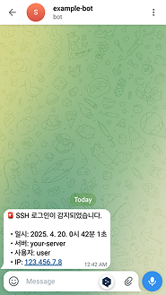

# SSH-LOGIN-JS

SSH 로그인 성공을 실시간으로 감지해 Telegram 메시지를 전송하는 경량 보안 알림 시스템

## 주의 사항

- Ubuntu 24.04.2 LTS에서 테스트되었습니다.
- 여러 사용자를 가지고 있는 서버의 경우, 알림 메시지를 받길 원하는 사용자 계정으로 로그인하여 [시작하기](#시작하기) 섹션을 수행해야 합니다.

## 시작하기

1. 리포지토리를 서버의 홈 디렉터리에 복제합니다.

   ```shell
   cd ~
   git clone https://github.com/radiantbeing/ssh-notify-js.git
   ```

2. 의존성 패키지를 설치합니다.

   ```shell
   cd ~/ssh-notify-js
   npm install
   ```

3. `.env.template` 파일의 이름을 `.env`로 변경합니다.

   ```shell
   mv ~/ssh-notify-js/.env.template ~/ssh-notify-js/.env
   ```

4. `.env` 파일을 열어 [Telegram Bot의 token과 chat_id](https://gist.github.com/nafiesl/4ad622f344cd1dc3bb1ecbe468ff9f8a) 환경 변수를 등록합니다.

   ```shell
   nano ~/ssh-notify-js/.env

   # TELEGRAM_BOT_TOKEN=123456:ABC-DEF1234ghIkl-zyx57W2v1u123ew11
   # TELEGRAM_CHAT_ID=0123456789
   ```

5. `~/.bashrc` 파일에 `index.js`를 실행하기 위한 스크립트를 작성합니다.

   ```shell
   # NVM을 사용하고 있다면 NVM 환경 변수 선언 하단에
   # 내용을 작성합니다.

   # NVM 환경 변수 선언 예시:
   # export NVM_DIR="$HOME/.nvm"
   # ...

   if [[ -n "$SSH_CONNECTION" ]]; then
   /usr/bin/env node ~/ssh-notify-js/index.js >> ~/ssh-notify-js/log.txt 2>&1 & disown
   fi
   ```

## 스크린샷


