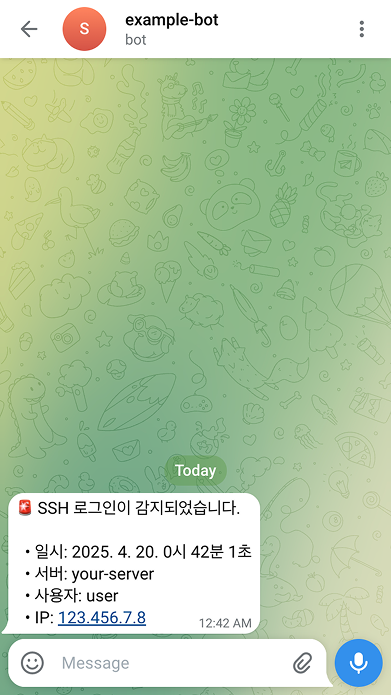

# SSH-NOTIFY-JS

> Node.js 기반의 경량 보안 알림 시스템

SSH 로그인 시도를 실시간으로 감지하고 Telegram으로 알림을 전송합니다.

## 지원 환경 및 주의 사항

- Ubuntu 24.04.2 LTS에서 테스트되었습니다.
- 서버에 여러 사용자가 존재할 경우, 알림을 받고자 하는 사용자 계정으로 [시작하기](#시작하기) 섹션을 진행해야 합니다.

## 시작하기

1. 리포지토리를 서버의 홈 디렉터리에 복제합니다.

   ```bash
   cd ~
   git clone https://github.com/radiantbeing/ssh-notify-js.git
   ```

2. 의존성 패키지를 설치합니다.

   ```bash
   cd ~/ssh-notify-js
   npm install
   ```

3. `.env.template` 파일의 이름을 `.env`로 변경하고 환경 변수를 설정합니다.

   ```bash
   mv ~/ssh-notify-js/.env.template ~/ssh-notify-js/.env
   nano ~/ssh-notify-js/.env
   ```

   다음 항목을 설정합니다: [token과 chat_id 확인 방법](https://gist.github.com/nafiesl/4ad622f344cd1dc3bb1ecbe468ff9f8a)

   ```
   TELEGRAM_BOT_TOKEN=123456:ABC-DEF1234ghIkl-zyx57W2v1u123ew11
   TELEGRAM_CHAT_ID=0123456789
   ```

4. `.bashrc` 파일에 로그인 감지 스크립트를 추가합니다.

   ```bash
   nano ~/.bashrc
   ```

   ```bash
   # NVM을 사용하는 경우, 관련 환경 변수 선언 이후에 작성

   if [[ -n "$SSH_CONNECTION" ]]; then
     /usr/bin/env node ~/ssh-notify-js/index.js >> ~/ssh-notify-js/log.txt 2>&1 & disown
   fi
   ```

5. SSH 로그인 성공 시 알림 메시지 수신을 확인합니다.

   
